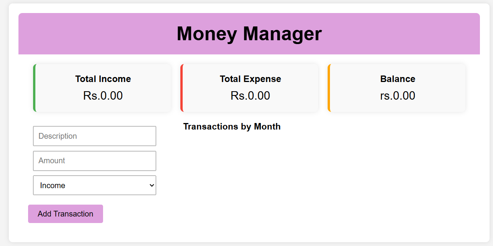
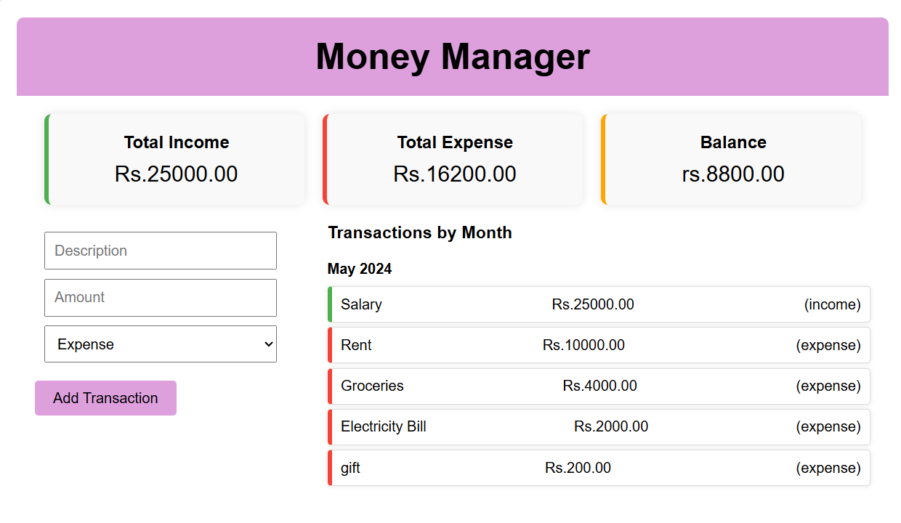

<br />
<div align="center">

  <h1 align="center">MONEY MANAGER</h1>
  <p>Money Manager is a simple React application that allows you to track your income and expenses, calculate the balance, and view transactions by month.
</p>

  <p align="center">
    Welcome to our project!
    <br />
    <br />
  </p>
</div>

## Screenshots

<div id="screenshots">
 1.Home

2.Transctions with History

</div>

## Features

- Add income and expenses
- View total income, total expenses, and balance
- View transactions grouped by month


## Installation

1. Clone the repository:
    ```bash
    git clone https://github.com/yourusername/money-manager.git
    cd money-manager
    ```

2. Install the dependencies:
    ```bash
    npm install
    ```

3. Start the development server:
    ```bash
    npm start
    ```

4. Open your browser and navigate to `http://localhost:3000`

## Usage

1. Enter a description and amount for your transaction.
2. Select whether it is an income or an expense.
3. Click the "Add Transaction" button to add it to the list.
4. View the summary of total income, total expenses, and balance at the top.
5. View transactions grouped by month below the form.


